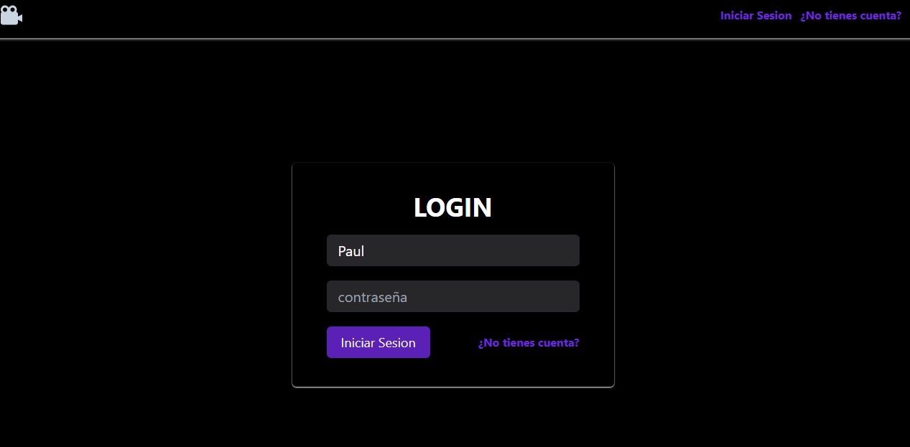
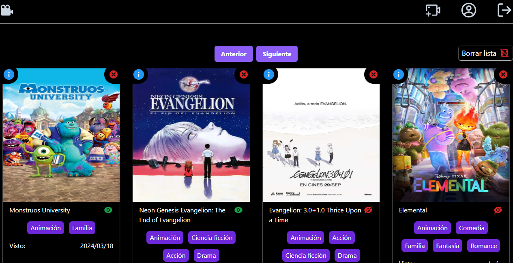
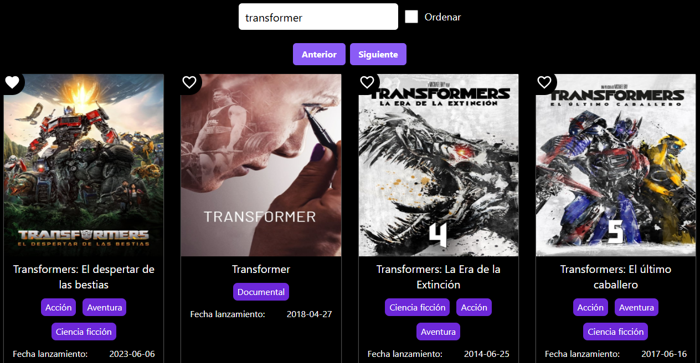

# Mis peliculas favoritas

Este proyecto es una aplicación que te permite poder tener tu lista de películas favoritas que son solicitadas desde una Api. 

## Contenidos

- [Requisitos](#requisitos)
- [Instalación](#instalación)
- [Conseguir credenciales de Mongo DB](#conseguir-credenciales-de-mongo-db)
- [Conseguir una API Key](#conseguir-una-api-key)
- [Despliegue Local](#despliegue-local)
- [Capturas de Pantalla](#capturas-de-pantalla)

## Requisitos

Para ejecutar este proyecto, necesitas tener instalado:

- Node.js (versión 14 o superior)
- npm (versión 6 o superior) o yarn (opcional)

## Instalación

1. Clona el repositorio en tu máquina local:

    ```bash
    git clone https://github.com/pauldev24/Movies_Favorite.git
    cd Movies_Favorite
    ```

2. Instala las dependencias del proyecto:

    Con npm en la carpeta raiz:
    ```bash
    npm install
    ```

    Con yarn en la carpeta raíz:
    ```bash
    yarn install
    ```

    Con npm en la carpeta client:
    ```bash
    npm install
    ```

    Con yarn en la carpeta raíz:
    ```bash
    yarn install
    ```

## Conseguir credenciales de Mongo DB

Para tener una base de datos que almanece el contenido de las peliculas y la interacción:
- Ve a Mongo Atlas.
- Registrate o inicia sessión en tu cuenta.
- Crea un nuevo cluster y pega las credenciales en el archivo .env de la raíz del proyecto:
```bash
NODE_ENV='development'
PORT=5000
MONGODB_URI="mongodb+srv://..."
TOKEN_SECRET="tu-token-secret-para-bycript"
FRONTED_URL="http://localhost:5173"
```

## Conseguir una API Key

Para llamar a la api de películas:
- Ve a Enlace de la API [https://api.themoviedb.org/].
- Regístrate o inicia sesión en tu cuenta.
- Sigue las instrucciones para generar una nueva API Key.
- Copia tu API Key y pégala en el archivo .env en la raíz del proyecto de la siguiente manera

```bash
URL_MOVIES_SEARCH="https://api.themoviedb.org/3/search/movie?api_key=TUAPIKEY&language=es-ES&query="
```

## Despliegue Local

Para ejecutar el proyecto en tu entorno local debes construir la interfaz de usuario en la carpeta client:

Con npm:
```bash
npm run build
```

Luego ejecutas en la raíz del proyecto en el comando: 

```bash
npm run dev
```

## Capturas de Pantalla


